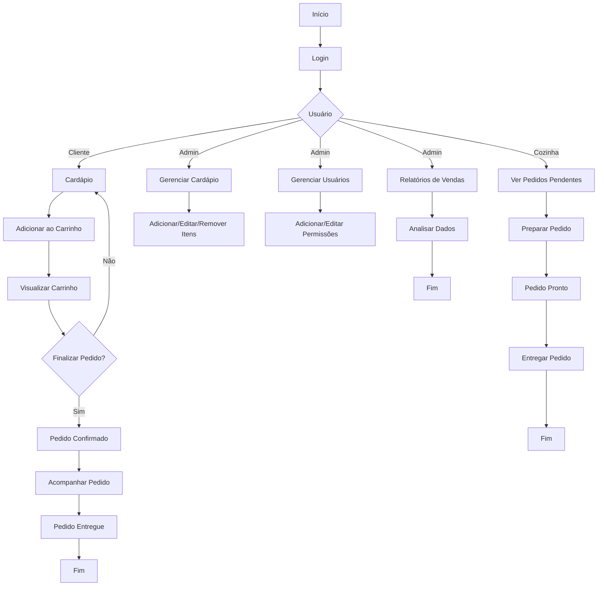

# 🍕 pizzaria-app

Aplicação front-end para gerenciamento de uma pizzaria, com funcionalidades voltadas para clientes, cozinha, entregadores e administradores. Desenvolvido com foco em boas práticas de React, incluindo autenticação, rotas protegidas, Context API, componentização e comunicação com backend.

---

## 🧠 Objetivos Educacionais

Este projeto foi desenvolvido como parte de um exercício prático, proposto pelo Prof. Emmerson para fixação dos seguintes conteúdos:

- 🔐 Autenticação de usuários e rotas protegidas
- ⚛️ Gerenciamento de estado global com Context API
- 🧩 Componentização e reuso de código
- 🔌 Comunicação com API/backend
- 🗂️ Estrutura modular e organização de projetos React
- 🧠 UX e boas práticas de desenvolvimento front-end

# Fluxograma do Aplicativo da Pizzaria  

