# 🍕 pizzaria-app

Aplicação front-end para gerenciamento de uma pizzaria, com funcionalidades voltadas para clientes, cozinha, entregadores e administradores. Desenvolvido com foco em boas práticas de React, incluindo autenticação, rotas protegidas, Context API, componentização e comunicação com backend.

---

## 🧠 Objetivos Educacionais

Este projeto foi desenvolvido como parte de um exercício prático, proposto pelo Prof. Emmerson para fixação dos seguintes conteúdos:

- 🔐 Autenticação de usuários e rotas protegidas
- ⚛️ Gerenciamento de estado global com Context API
- 🧩 Componentização e reuso de código
- 🔌 Comunicação com API/backend
- 🗂️ Estrutura modular e organização de projetos React
- 🧠 UX e boas práticas de desenvolvimento front-end

# Fluxo da Aplicação

```mermaid
flowchart TD
    A["Início"] --> B["Cardápio Público"]
    B --> D["Visualizar Produtos"]
    D --> E["Adicionar ao Carrinho"]
    E --> F["Visualizar Carrinho"]
    F --> G{Finalizar Pedido?}
    
    G -->|Sim| J["Pedido Confirmado"]
    G -->|Não| B
    
    J --> K["Acompanhar Pedido"]
    K --> L["Pedido Entregue"]
    L --> M["Fim"]
    
    %% Fluxo da Cozinha
    P["Login Cozinha"] --> Q["Ver Pedidos Pendentes"]
    Q --> R["Preparar Pedido"]
    R --> S["Pedido Pronto"]
    S --> T["Entregar Pedido"]
    T --> U["Fim"]
    
    %% Fluxo do Admin
    V["Login Admin"] --> W["Gerenciar Cardápio"]
    V --> AD["Relatórios"]
    
    W --> X["Adicionar/Editar/Remover Itens"]
    X --> AC["Fim"]
    
    AD --> AE["Vendas, Pedidos, Estoque"]
    AE --> AC["Fim"]
```

